.. Adding labels to the beginning of your lab is helpful for linking to the lab from other pages
.. _BCA:

-------------
BCA
-------------

Lab 1: Running HammerDB
+++++++++++++++++++++++++++++++

1.1 Download the HammerDB
..........................

HammerDB is an open source database load testing and benchmarking tool for Oracle Database,
Microsoft SQL Server, IBM DB2, TimesTen, MySQL, MariaDB,  PostgreSQL,Postgres Plus Advanced Server,
Greenplum, Redis, Amazon Aurora and Redshift and Trafodion SQL on Hadoop. You can download from here.

http://www.hammerdb.com/download.html

It provide the Windows version as well as Linux version.
You can also download the documents from this link.

http://www.hammerdb.com/hammerdb_quickstart_mssql.pdf

1.2 Install HammerDB
..........................

Install HammerDB is very easy , download the package from the website , and follow the Windows installation.
Next-> Next or you can reference the installation guide that provide by

http://www.hammerdb.com/hammerdb_install_guide.pdf

1.3 Start the TPCC testing
..........................

Once the HammerDB application is open, in the Benchmark pane, select TPC-C

http://www.tpc.org/tpcc/

TPC Benchmark C is an on-line transaction processing (OLTP) benchmark.
In the Benchmark Options box, select MSSQL Server and TPC-C and then click OK

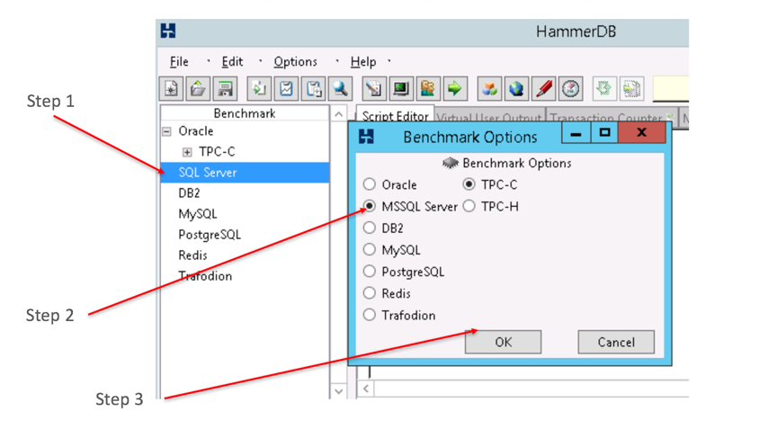

1.4 Build testing schema
..........................

First all, you need build a schema for the whole testing . Some of the vender will create a small schema like 1GB or maybe less than 100 MB . This is not a correct testing . When they create such small database schema . The data always on the database buffer , so the performance look so great . Suggest should be same size of customer current database or great than database’s buffer size .
Steps-  Below TPC-C, click Schema Build and then double-click Options.
In the window that appears, enter your SQL Server host name, or IP address, database username, and password.
After you fill up all the parameter , then click “OK”

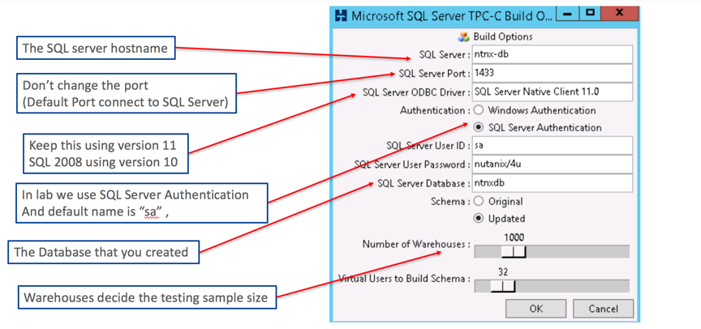

1.5 Size of warehouse
..........................

When you choose the warehouse , that means the size of the schema. Please check the table below –

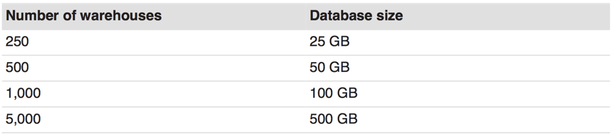

In current version , the maximum size of the schema is 500GB . Remember 100 about 10GB schema size .
After everything setup completed in the option , then go schema build – Follow the diagram shows.
If your VM have multiple vCPU, you can choose multiple virtual users help to accelerate the build process.

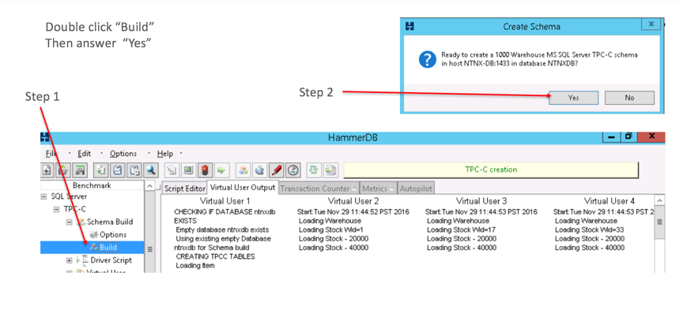

1.6 Create the driver script
..........................

Driver create is to generate the script for testing and setup “how long we need to test and rampup time” .  Here are steps -

1.In the Benchmark pane, expand the Driver Script section and double-click Options

2.Configure the SQL Server hostname, IP, login, password, and database name to match the environment. In this case, use the same settings used when creating the database.

3.Select the Timed Test Driver script and select the Checkpoint when complete.

4.To ensure a realistic workload, use five Minutes of Rampup Time and 10 Minutes for Test Duration.

5.Once all settings are configured, click OK to exit the menu

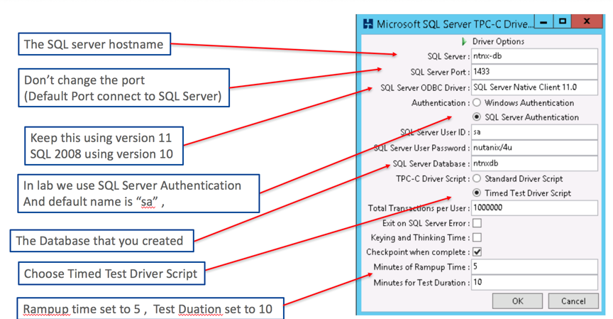

Note - If you need to run a test with SQL 2008, use SQL Server Native Client 10.0.

6.Next, double-click Load in the Driver Script section of the Benchmark pane to activate the driver script (see the figure below)

7.Load the driver Script

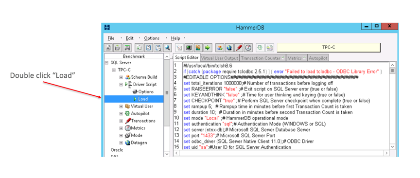

1.7 Configure the virtual users
................................

Configure how many users you need to run concurrent in the system. In my example,
I show 100 users running concurrently. But you can try different users and see if the TPM is go up?
When you add more users then you saw the TPM is not coming up . That means you have some bottleneck in CPU, Memory or IO. You need to figure out why ? Using our Prism and Window performance monitor tools to diagnostic the bottleneck
Steps –

1.Expand the Virtual Users section and double click Options.

2.The number of virtual users depends on the configuration used to create the database.
TPC- C recommends using a 10x ratio to prevent row locking. Accordingly, if you defined your warehouse count (scale) as 1,000,
then set the Virtual Users to 100.

3.For the TPC-C driver script, HammerDB recommends leaving the Iterations, User Delays,
and Repeat Delays at the “default settings” and to modify only the Total Transactions per User,
or total iterations value, inside the Driver Script.

4.Select the Show Output checkbox to enable error messages in the console.

5.Click OK.

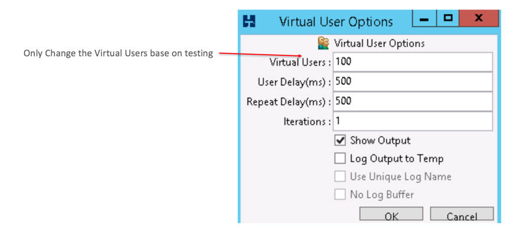

6.Click run

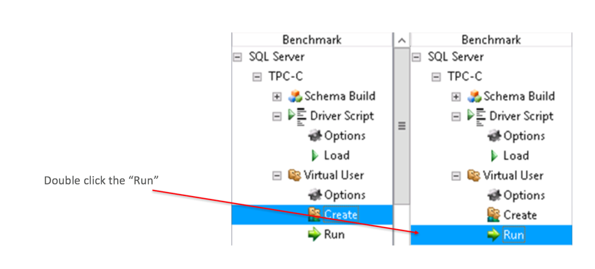

1.8 Metrics provide by HammerDB
................................

After you installed the hammnerDB , you can find in your folder have three files cslled “hdbagent.bat”, “hdbagent.tcl”, “ mpstat”.
These files are for monitoring the CPU resources in the testing VM .

Running the Agent – please execute the agent in your testing VM .
Windows just need to double click the .bat file. In the Linux system, you need to execute the .tcl file .
After you run the agent , you will see a screen like below .

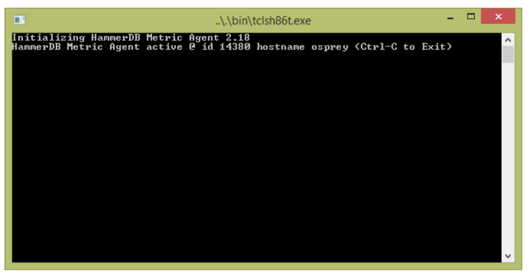

Remember this @ id “xxxxx”. Our example is 14380 . remember this number .
Go back to hammerDB main screen , choose the Metrics

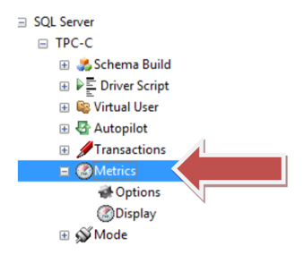

Double click the Options , then it will show the “Connect to Agent Options” , just give the id and hostname (The ID is what we get in previous screen 14380) . Click on the Display button or treeview to connect to the agent.

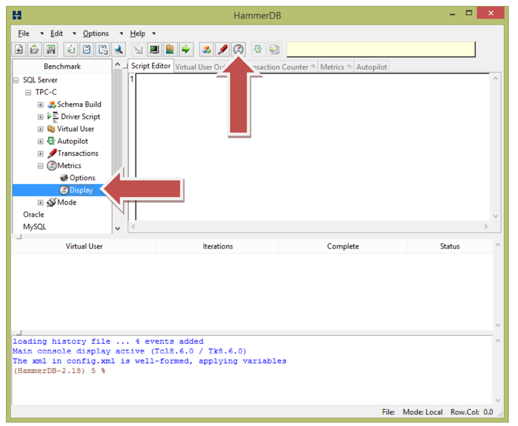

Overview
++++++++

Here is where we provide a high level description of what the user will be doing during this module. We want to frame why this content is relevant to an SE/Services Consultant and what we expect them to understand after completing the lab.

Using Text and Figures
++++++++++++++++++++++

Label sections appropriately, see existing labs if further guidance is required. Section titles should begin with present tense verbs to queue what is being done in each section. Use consistent markup for titles, subtitles, sub-subtitles, etc. The markup in the example can serve as a guide but other characters can be used within a given workshop, as long as they are consistent. Other than lab titles (that need to follow a certain linear progression) avoid numbering steps.

Below are examples of standards we should strive to maintain in writing lab guides. *Italics* is used to indicate when information of values external to the lab guide are referenced. **Bold** is used to reference words and phrases in the UI. **Bold** should also be used to highlight the key name in lists containing key/value pairs as shown below. The **>** character is used to show a reasonable progression of clicks, such as traversing a drop down menu. When appropriate, try to consolidate short, simple tasks. ``Literals`` should be used for file paths.

Actions should end with a period, or optionally with a colon as in the case of displaying a list of fields that need to be populated. Keep the language consistent: open, click/select, fill out, log in, and execute.

Use the **figure** directive to include images in your lab guide or appendix. Image files should be included within the Git repository, within an **images** subdirectory within each lab subdirectory.

-----------------------------------------------------

Open \https://<*NUTANIX-CLUSTER-IP*>:9440 in your browser to access Prism. Log in as a user with administrative priveleges.

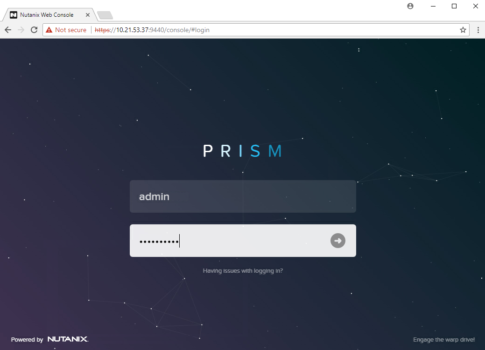

Click **Network Config > User VM Interfaces > + Create Network**.

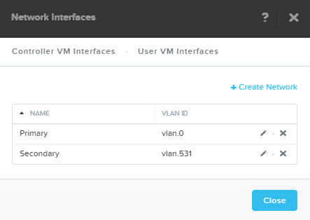

Select **Enable IP Address Management** and fill out the following fields:

  - **Name** - VM VLAN
  - **VLAN ID** - *Refer to your Environment Details Worksheet*
  - **Network IP Address/Prefix Length** - *Refer to your Environment Details Worksheet*
  - **Gateway IP Address** - *Refer to your Environment Details Worksheet*
  - **Domain Name Servers** - *Refer to your Environment Details Worksheet*

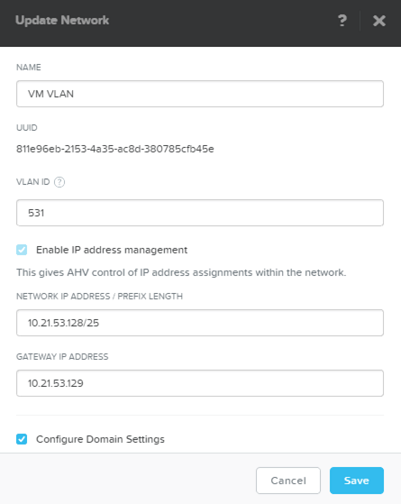

Click **Submit > Save**.

Takeaways
............

- Here is where we summarize any key takeaways from the module
- Such as how a Nutanix feature used in the lab delivers value
- Or highlighting a differentiator

Lab 2: Apply Microsoft SQL best practice
++++++++++++++++++++++++++++++++++++++++++

2.1 Apply the SQL best practice
----------------

When you go customer site for POC , please make sure everything already follow our SQL best practice guide.
You can find in Nutanix Website and download it. Please download two versions ,
one is SQL server 2008R2 ,2012, 2014 on Nutanix , and the other one is SQL server 2016 on Nutanix.
There are some little difference. Some of the parameter you don’t need to apply in the SQL server 2016.

2.2 Disk layout
----------------

The most important thing in the SQL server is design the I/O. Some of the customers who move physical servers to virtual server ,
they forget to design I/O. Consequence is lose the performance.
In Nutanix, you can use any hypervisor. For the ESXi and AHV as a example .
ESXi you need to separate disks into different pv-scsi initiators.
AHV we use the virtio, it can support more queue in a single virtual scsi. So you just need one scsi to have all of the vdisks.

Here is a layout of SQL design for the ESXi , but for the AHV , the Controller will be only one controller.

In this lab , we will use AHV as our lab. ESXi just for your reference .

we need create 100GB x2 locate in PVSCSI 1, 2 , 80 GBx 2 locate in PVSCSI 3,0 , 50 GB x1 locate in PVSCSI 3, 40 GB x1 ocate in PVSCSI1 (ESXi)

In the AHV , just create the disks , do not need to care about multiple virtual scsi

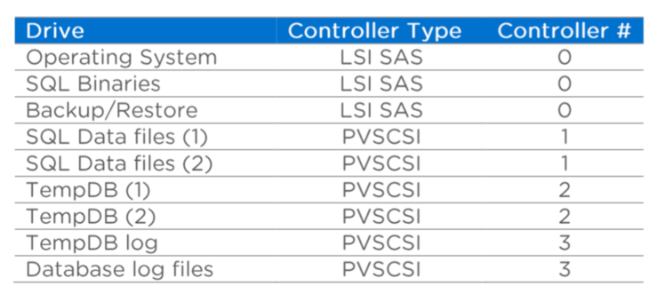

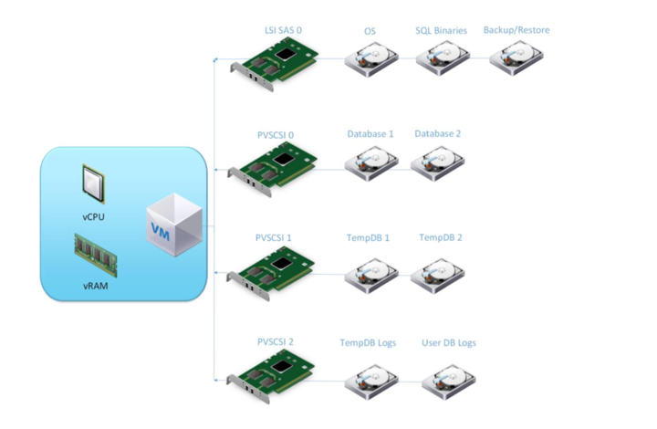

2.4 Format the vdisk using 64k block size 
-----------------------------------------

format the NTFS file system to 64K.

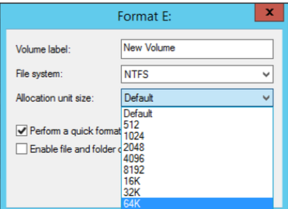

After you did every disk format , you will see this in the OS level , you will see drives like this – Two SQL data disk, one SQL log disk . Two SQL TempDB disk , and one templog disk.

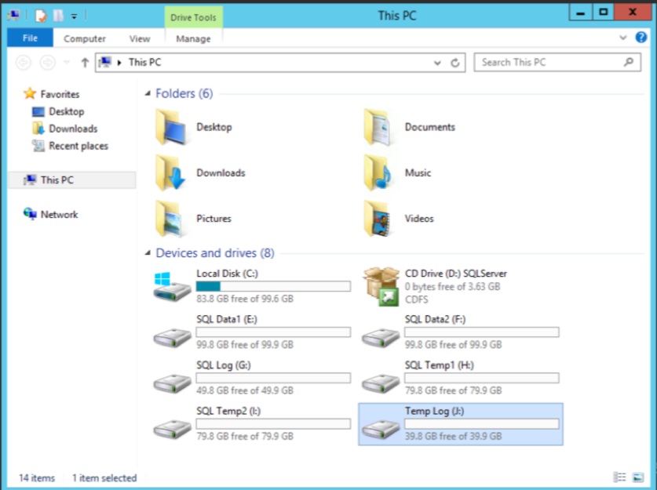

2.5 SQL Disk Configuration – Datafile 
-----------------------------------------

Per CPU per files – for example , if you have 4 vCPU and now your database is 400 GB . you can separate into two vdisk with 4 data files.
Enable auto growth in datafile, setup to 256 MB or 512 MB.

a.Click the user database and go properties – choose autogrowth/ Maxisize , default is 1MB, unlimited

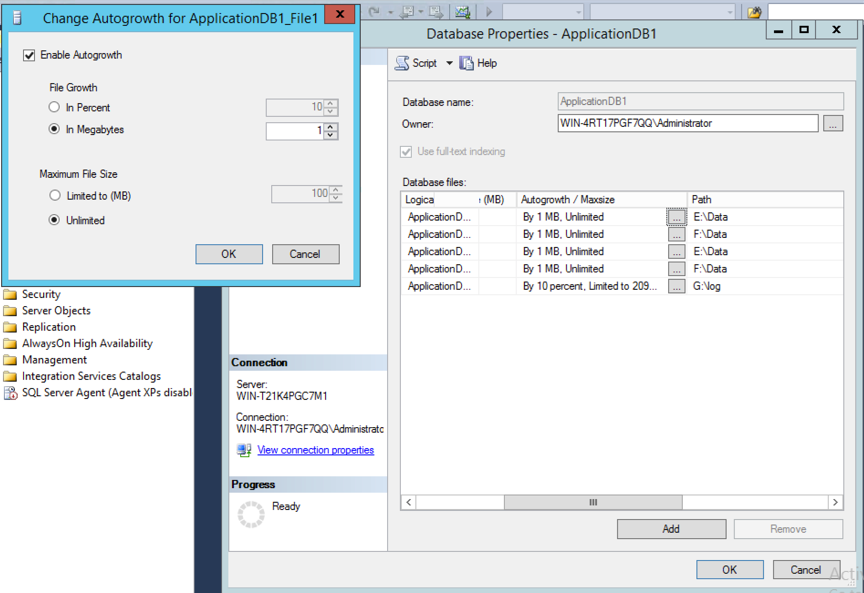

b.Change the size to 256 or 512 MB per growth

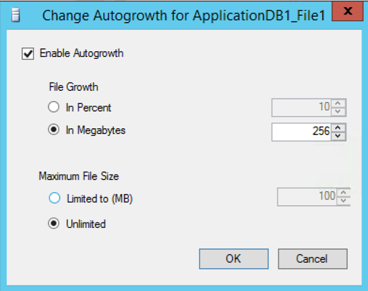

2.6 Enable IFI (Instant File Initialization) 
-----------------------------------------

When we extend the datafile , we do not need to wait the “Zero” be written in disk. That will fast SQL server IO process.

a.On the computer where the backup file will be created, open the Local Security Policy application (secpol.msc).

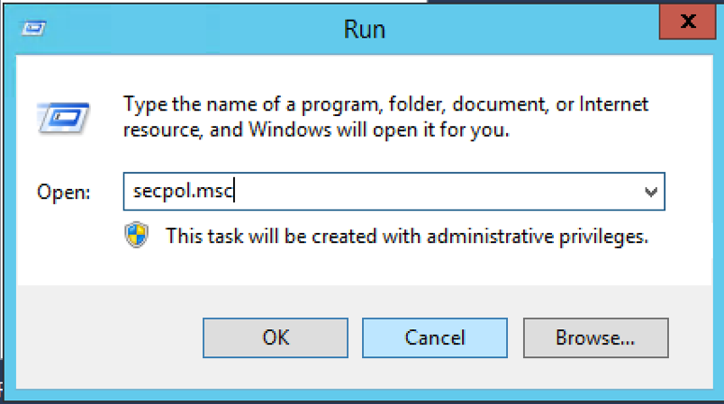

b.In the left pane, expand Local Policies, and then click User Rights Assignment. In the right pane, double-click Perform volume maintenance tasks.

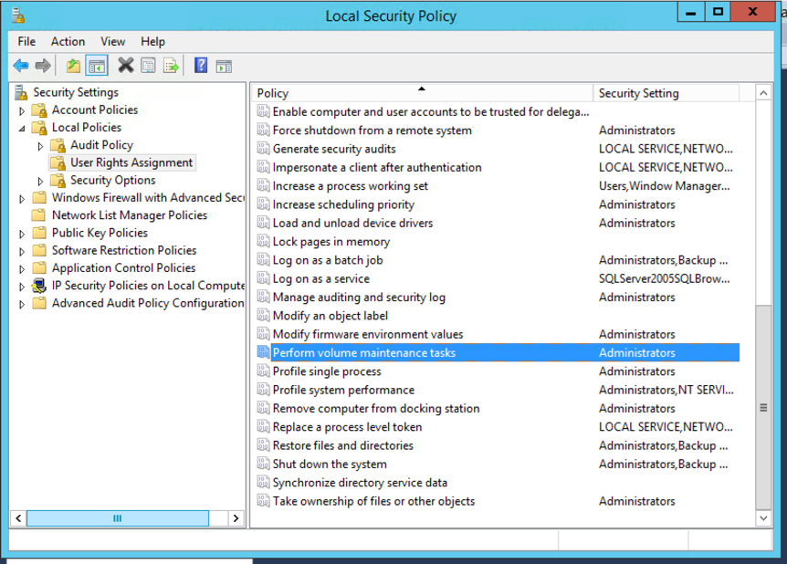

c.Click Add User or Group and add any user accounts that are used for backups.

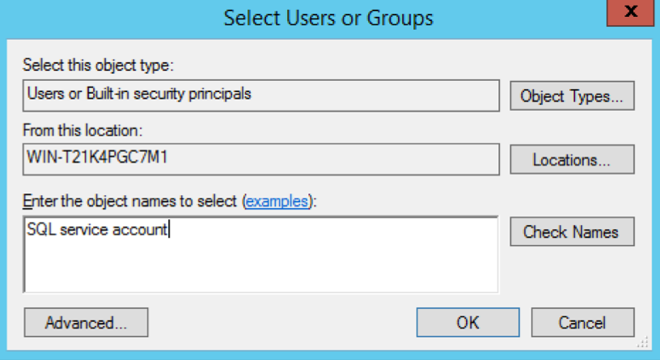

d.Click Apply, and then close all Local Security Policy dialog boxes.

2.7 Enable Trace flag 1117 
----------------

Make sure all data file growth equally.  Starting with SQL Server 2016 this behavior is controlled by the AUTOGROW_SINGLE_FILE and AUTOGROW_ALL_FILES option of ALTER DATABASE, and trace flag 1117 has no effect.
So please do when user using SQL 2014 and previous version. In our lab , we are using the SQL 2012R2 . We need to change this parameter .
Steps

a.Choose SQL Server Configuration Manager -


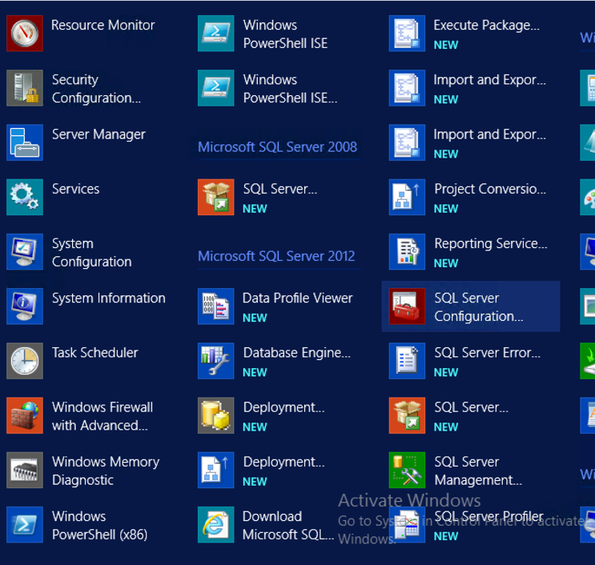

b.Choose “SQL Server Services” , double click SQL Server (MSSQLSERVER)


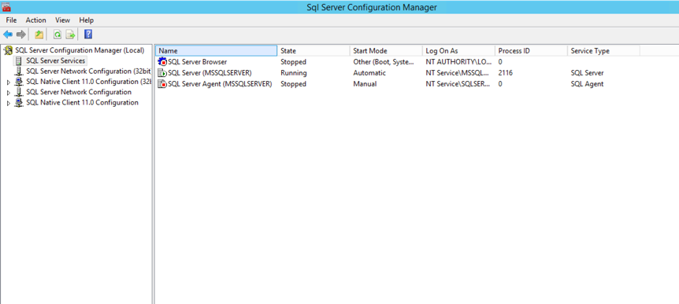

c.In the “startup parameters” tab , on the specify a startup parameter: Type –t1117, click Add and Apply

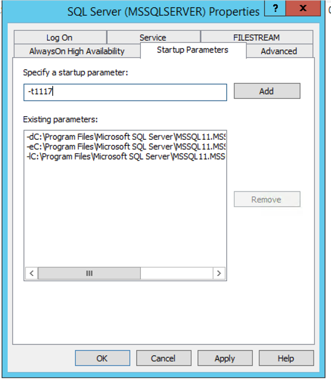

d.Restart SQL server service -

.. figure:: images/Lab221.png

2.8 Log File Design 
----------------

VLF- subset of the logifle , many VLF will compose one logfile. If the VLFs too small, database recovery and other operation will be very slow . If VLFs too large , the log backup and clearing logs can be small.
Optimal VLFs size is 256MB to 512MB . Pre set the logfile start from 4 GB or 8 GB , grow it by the same amount to reach . For ex: if you need 128 GB log , you may create 8 GB log in first time , then grow 15 times .
Using DBCC Loginfo to check VLF size

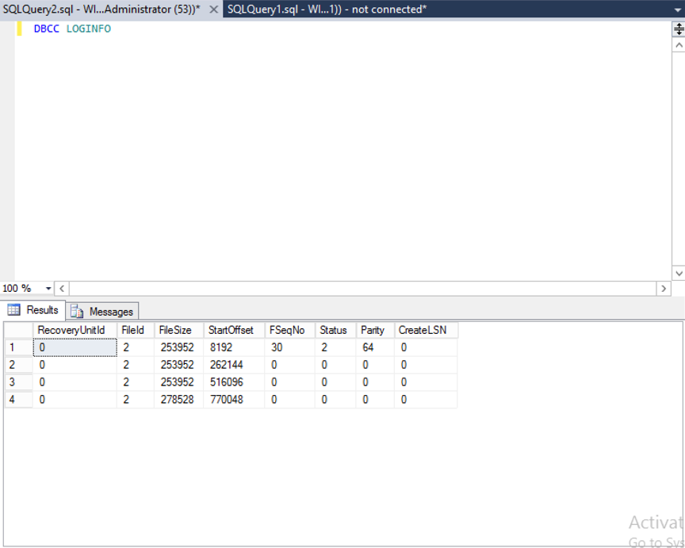

2.9 Setup Log in SQL server

----------------

a.Select the database you created , and selet the “Properties”

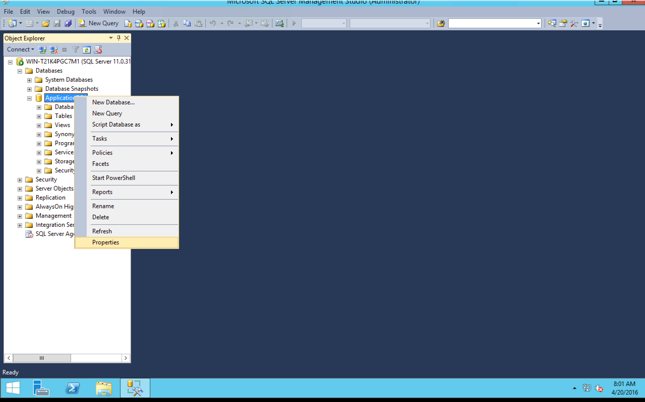

b.In the “Files” , check the File type is Log . that is the log for this database. Make sure the location of the log file is different from data files.

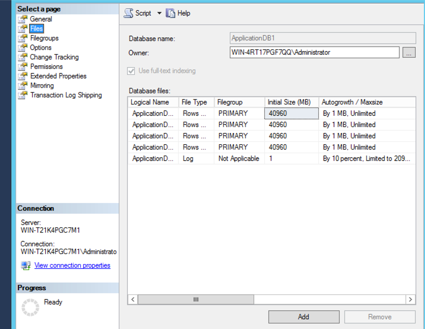

c.Select the initial Size (MB) , and input 4096 or 8192 depends on your database log requirement .

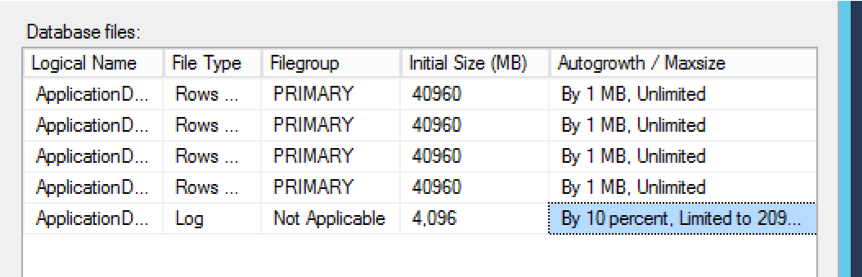

d.In the “AutoGrowth/Maxsize” , Click “...” , tick the “Enable Autogrowth” and File Growth select in Megabytes input 4096 or 8192 , depends on your initial size. (should be same). Click “OK”.

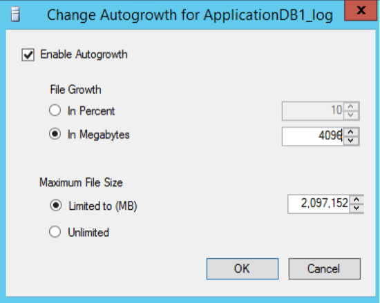

2.10 TempDB Desing 
----------------

When your VM vCPU Under eight vCPU , please configure same number of temp data files for tempDB. Ex: if you have four vCPU just configure four tempDB datafiles.
If your VM is eight CPU or above start from eight temp files. Start with two vDisk with tempDB, one vdisk for templog , to separate the IO load. In this lab , we create eight tempDB data files.

After SQL 2016 , SQL server will create multiple tempDB datafiles for you. But you need to check the location by yourself.

2.11 How to change Original Tempdb data & log location 
----------------

The original tempDB is locate in the C: driver, so it is terrible configuration. We must move the temp files into different disk. We can use SQL statement to move it , and after moved , you need to restart the database.


a.Original tempDB location . Open the tempDB Properties , choose the Files . You can see the current tempDB datafile and log location.

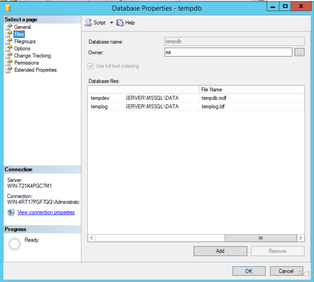

b.Go SQL Query - Issue those SQL to change tempdb data and log files location. We can’t use the GUI to change the location of TempDB files. Please use SQL command to change location.

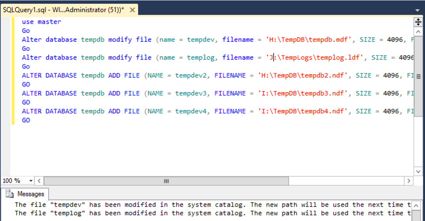

c.Restart SQL database server -
After you change the location , Please restart the database and make this worked.

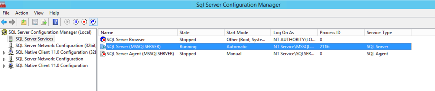

d.After restart the database , you will see the tempDB files ,and log will spread into multiple drives.


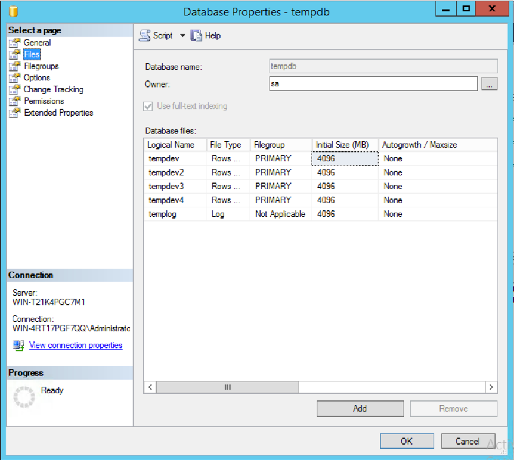

e.Setup the increase of temp files and log , the log will be increase base on you initial size for ex: 4096 MB ,next will be same size of 4096 MB

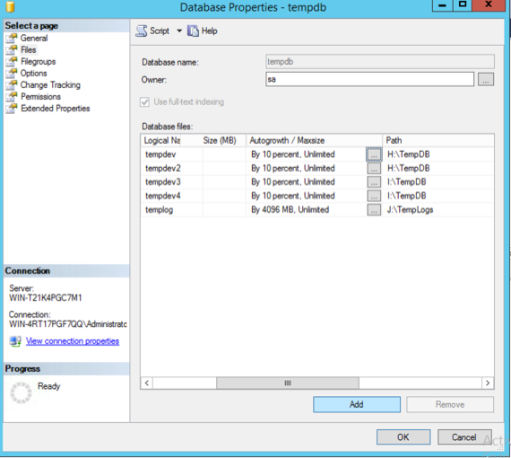

2.15 Guest OS tools (AHV Guest Tools) must be installed
-----------------------------------------

VMtools and Microsoft Integration tools must installed , due to many drivers inside those applications.
You must install the guest tools to make sure the maximum performance and good support in Guest OS .

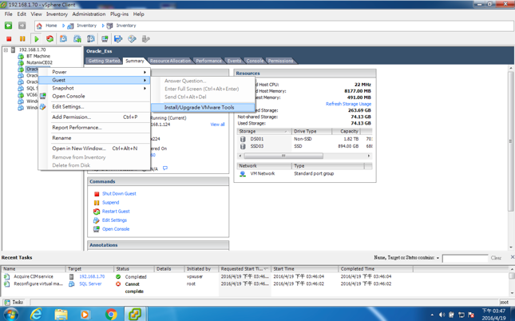

AHV VM Guest Tools install – Choose from the Prism Console

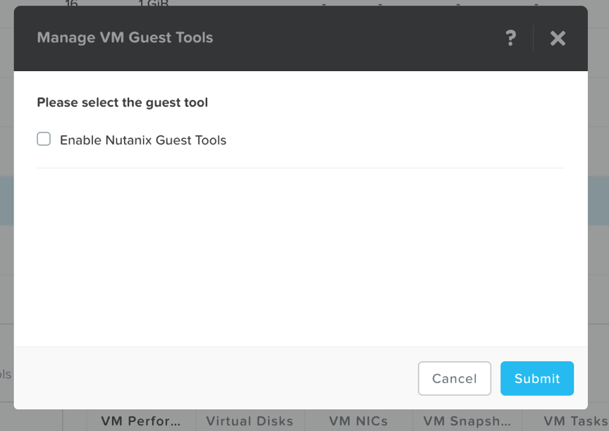

2.16 Enable huge page in windows server
-----------------------------------------

Enable huge page in Guest OS When VM great than 8GB (Tflag 834 , no need SQL 2012 ) . Exception -  If you are using the Columnstore Index feature of SQL Server 2012 to SQL Server 2017, we do not recommend turning on trace flag 834.

a.In the local security policy , go to Security Setting , Local Policy then User Rights
Assignment. Search Lock pages in memory . Double click -

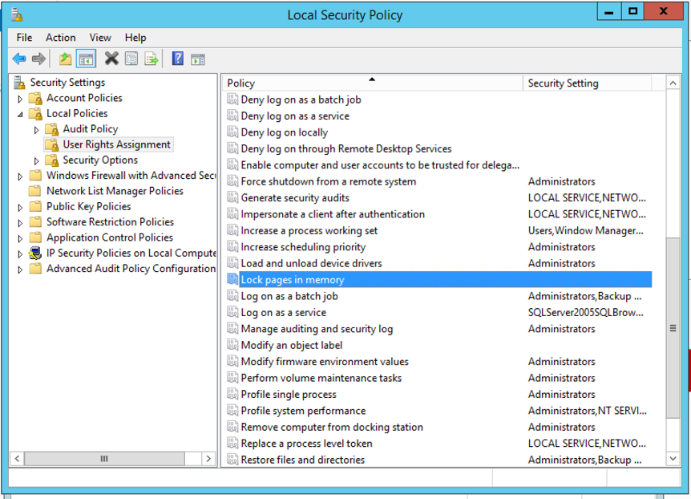

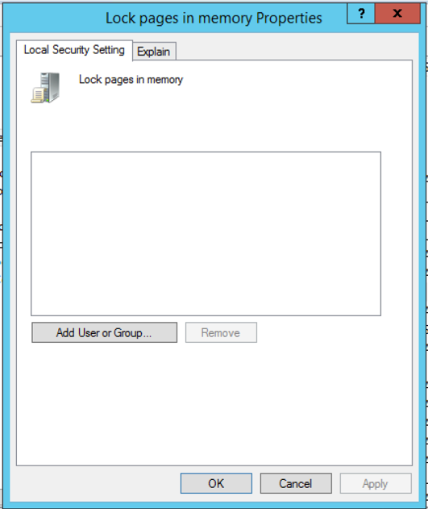

b.Key in the SQL service account (user will have their own SQL administrator account or group ), after key-in click “OK”. In this lab , our SQL administrator is our domain administrator.

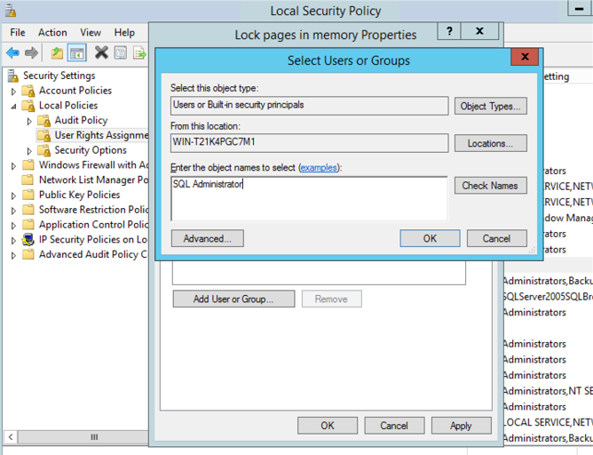

c.Click OK then go back - Apply

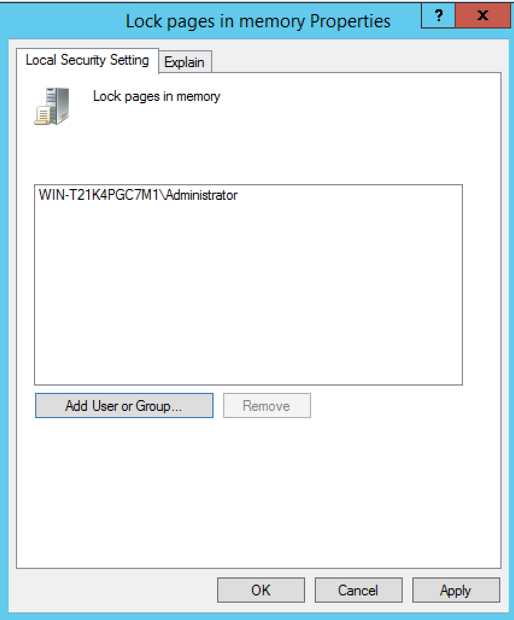

2.18 SQL Server Memory Configuration 
-----------------------------------------

When you reserved all memory on your virtual machine. This machine we have OS and SQL server instance. Please use follow table to configure your maximum memory of SQL Server . When setup the SQL Maximum RAM , more IO will keep in the
RAM so there will less IO happen in disk. Restart VM
a.Using SQL management studio connect to SQL instance, select instance and right click . Choose Properties

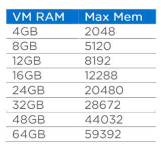
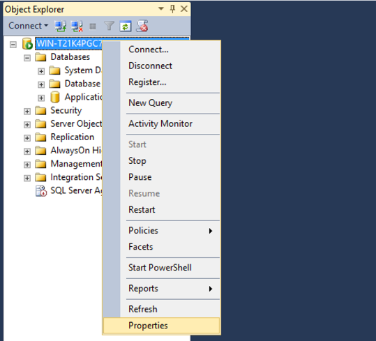

b.Setup the Memory the Maximum server memory and Minimum server memory same value (fix)

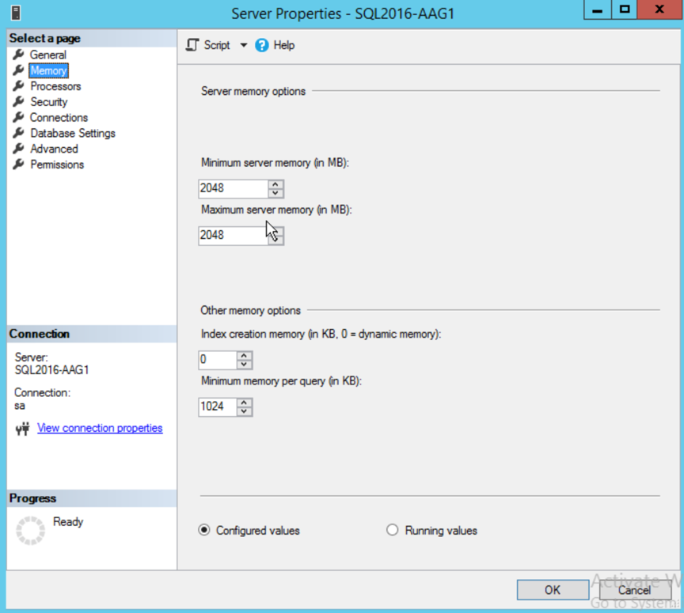

2.19 vCPU Rules
-----------------------------------------

Some key rule is list here. Most of the CPU configuration are set (do not tune anything) , just follow the NUMA rules
Rule 1 - Do not enable hot add CPU , because vNUMA will be disable (ESXi) . SQL on ESXi can get some benefit from vNUMA.

Rule 2 - Hyper-v disable NUMA spanning

2.21 Nutanix Configuration Settings
-----------------------------------------

In Nutanix, because we are web-scale system . There is nothing need to configure in the Nutanix level . But some of the rule must be follow

a.Single Container – Simple make things beauty. We can have second container, but that will depends on the CVM processor usage.

b.Node choose- When you have heavy SQL IO , please choose high memory node. And follow the key concept , reserve memory and also set the right size of SQL instance memory.


2.22 Disable shadow clone
-----------------------------------------

a.Using ssh login to the CVM (anyone of them) , username: nutanix password:nutanix/4u case sensitive.

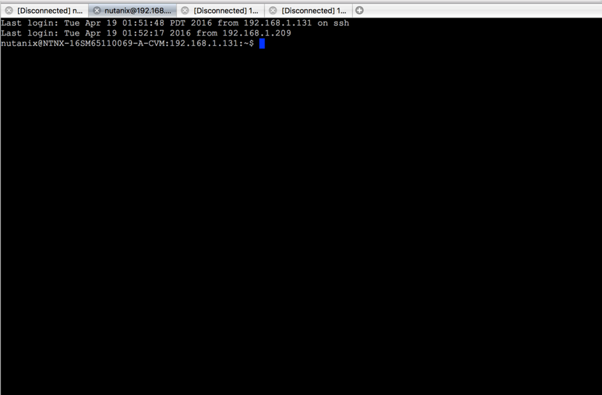

b.using ncli command to disable shadow clone . ncli cluster edit-params enable-shadow-clones=false

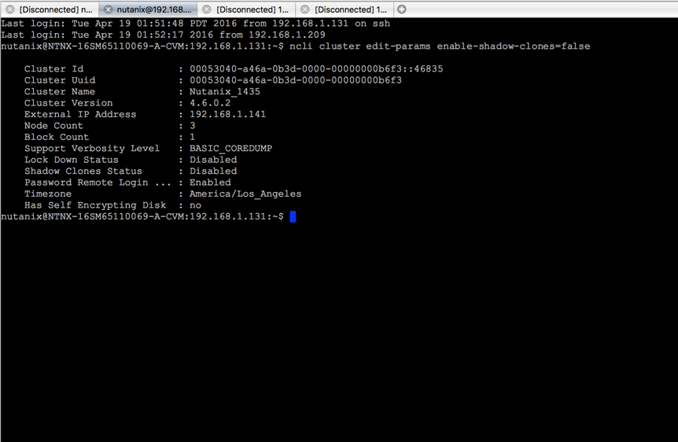

2.23 Enable Compression
-----------------------------------------

SQL Server 2012 after – enable data compression (testing before go production ). And also enable Nutanix container level compression.

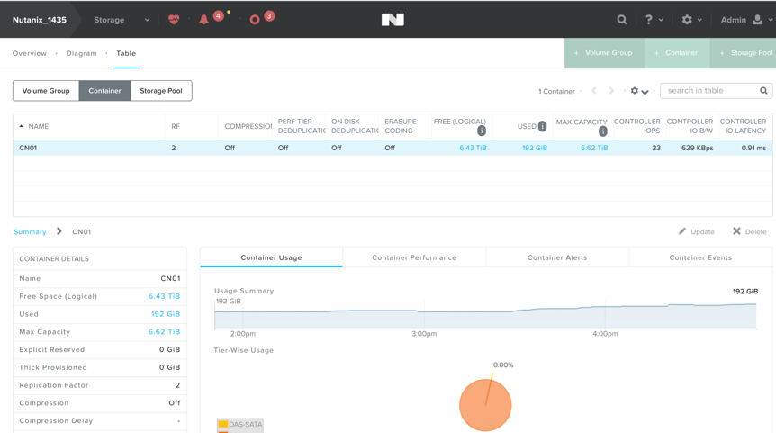

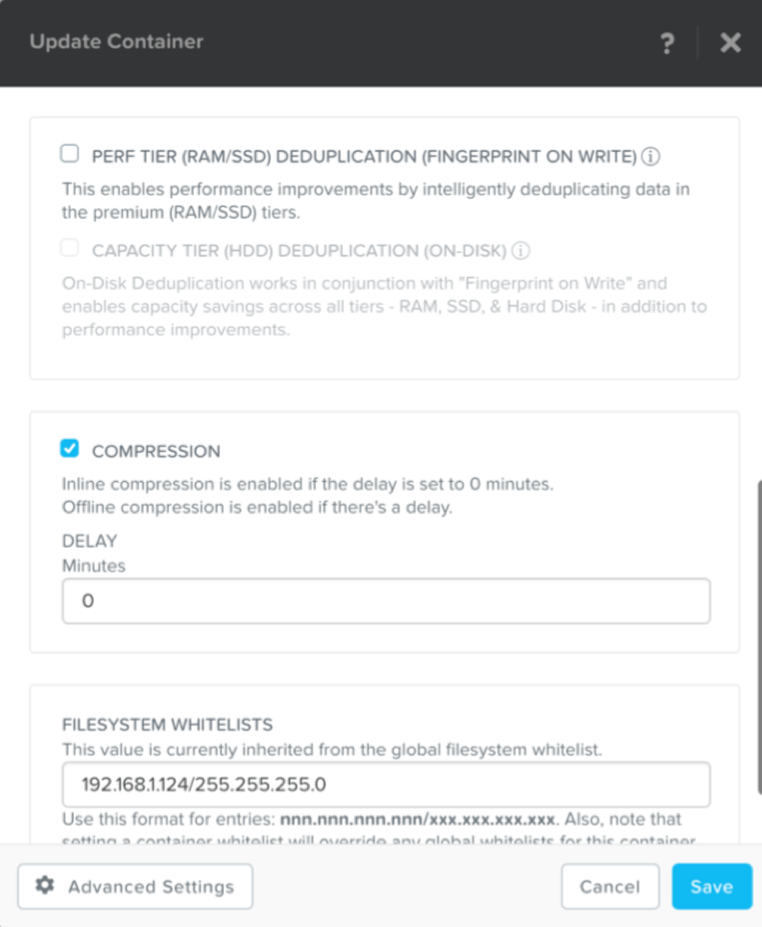

