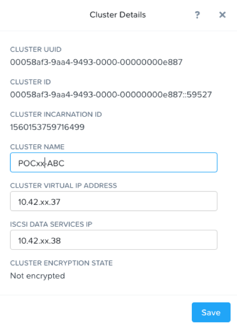
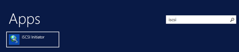
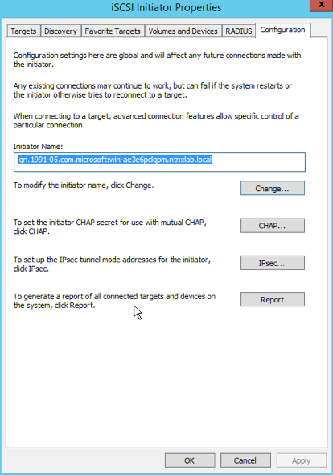
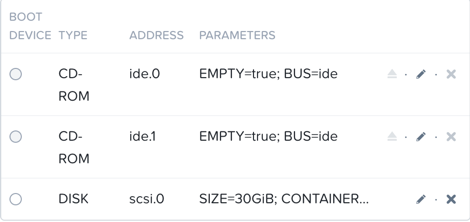
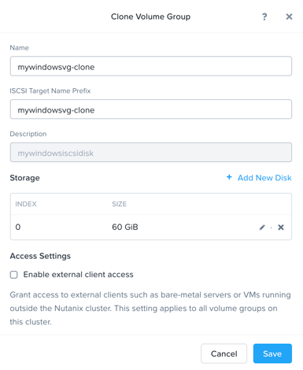
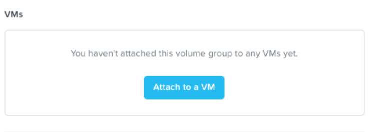
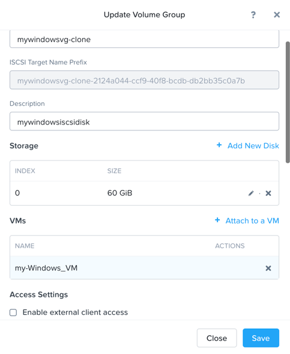

.. _volumes_lab:

-----
volumes
-----

Overview
++++++++

.. note::

  Estimated time to complete: **60 Minutes**

X-Ray is an automated testing application for virtualized infrastructure solutions. It is capable of running test scenarios end-to-end to evaluate system attributes in real-world use cases. In this exercise you will deploy and configure an X-Ray VM, run X-Ray tests, and analyze results.

As X-Ray powers down hosts for tests that evaluate availability and data integrity, it is best practice to run the X-Ray VM outside of the target cluster. Additionally, the X-Ray VM itself creates a small amount of storage and CPU overhead that could potentially skew results.

In this lab, we will deploy X-Ray VM on POCxx-D, and evalutate cluster POCxx-ABC we just created.

For environments where DHCP is unavailable (or there isn't a sufficiently large pool of addresses available), X-Ray supports `Link-local <https://en.wikipedia.org/wiki/Link-local_address>`_ or "Zero Configuration" networking, where the VMs communicate via self-assigned IPv4 addresses. In order to work, all of the VMs (including the X-Ray VM) need to reside on the same Layer 2 network. To use Link-local networking, your X-Ray VM's first NIC (eth0) should be on a network capable of communicating with your cluster. A second NIC (eth1) is added on a network without DHCP.

  
Configure Acropolis Block Services
++++++++++++++++++++++
  
Create Cluster External Data Services IP:
1.  Login to Prism
2.  Click the Cluster name in the upper left hand corner to access the Cluster Details 
3.  Enter the Cluster External Data Services IP Address provided to you in your Assigned Cluster Details (if it is not already set).

4.  Close Cluster Details and proceed to Configure Guests.

Enable and Configure ABS in Prism for Windows
+++++++++++++++++++++++++++++++++++

Ensure that the Windows2012R2-Prod VM has access to the Network:
1.  Login to Prism
2.  Navigate to the VM Dashboard, Table View
3.  Select Windows2012R2-Prod VM, and click Update       
4.  Ensure that the VM has a NIC added, if it does not, add one now and attach it to VLAN0.

.. figure:: images/2.png

 
5.  Save the VM Settings and continue to the next steps.

Login to the Windows Server guest VM to get the iSCSI iqn name:

1.  Login to Windows2012R2-Prod on your assigned cluster with username “administrator” and password “nutanix/4u”
2.  Click in the upper right hand corner of the desktop for the search window to appear.  It looks like a looking glass.  Click the Search icon.  Enter iscsi and “iscsi” and it will resolve to “iSCSI Initiator.”

 

3.  Click the “Configuration” tab to find the iqn.  Make a note of it for a later step.
 

Create a Volume Group in Prism:
5.  Login to Prism
6.  Navigate to the Storage Dashboard
7.  Click “+ Volume Group” to create a new Volume Group
8.  In the Volume Group Window give the volume group a name, Add a new disk and leave the default of “Allocate On Container” selected and the default container selected, and input a size for the disk of 60 and click Add.

9.  Click Save.

 
.. figure:: images/5.png

Connect ABS disks to Windows VM:
................................

1.  Click the VG again and find the volume group we previously created.  Click on our windows VG and click Update.
2.  Under Access Control check the box and add the iqn previously recorded.

.. figure:: images/6.png

3.  Switch back to your windows VM.  In the console of your windows VM in the iSCSI initiator properties click on the Targets tab.  Type in the data services ip and click Quick Connect.  You will see the target volume group we previously created.

 .. figure:: images/7.png

4.  Click Done.
5.  Open diskmgmt.msc from the Search menu and see the raw disk we added.  Optionally, click the disk to format and choose drive letter.

 .. figure:: images/8.png

Enable and Configure ABS in Prism for Linux
++++++++++++++++++++++++++++++++++++++++++++

Ensure that the CentOS VM has access to the Network:
1.  Login to Prism
2.  Navigate to the VM Dashboard, Table View
3.  Select the CentOS VM, and click Update       
4.  Ensure that the VM has a NIC added, if it does not, add one now and attach it to VLAN0.
 
Ensure that the CentOS VM has access to the Network:
1.  Login to Prism
2.  Navigate to the VM Dashboard, Table View
3.  Select the CentOS VM, and click Update       
4.  Ensure that the VM has a NIC added, if it does not, add one now and attach it to VLAN0.
 
 .. figure:: images/9.png

5.  Save the VM Settings and continue to the next steps.

Login to the Linux guest VM to get the iSCSI iqn name:

1.  Login to CentOS on your assigned cluster with username “root” and password “nutanix/4u”
2.  Install ISCSI Tools: If not already installed, run “yum –y install iscsi-initiator-utils” 
3.  Install lsscsi tools: If not already installed, run “yum –y install lsscsci” 
4.  To find the iqn name run “cat /etc/iscsi/initiatorname.iscsi”
5.  Copy down the iqn name of the iSCSI client initiator
 
 .. figure:: images/10.png

Create a Volume Group in Prism:
1.  Login to Prism
2.  Navigate to the Storage Dashboard
3.  Click “+ Volume Group” to create a new Volume Group
4.  In the Volume Group Window give the volume group a name, Add a new disk and leave the default of “Allocate On Container” selected and the default container selected, and input a size for the disk of 60 and click Add.
5.  In the Initiators section enter the iqn name of the Linux iSCSI initiator you copied down in step 4 of the previous section and click Add.
6.  Then click Save.

Connect ABS disks to Linux VM:
..............................

1.  Discover the Nutanix ABS target by running “iscsiadm -m discovery -t sendtargets -p <DataServicesIP>“.  It should come back with the iqn name of the Nutanix ABS target volume.  Make note of this name.
Example:
 
 .. figure:: images/11.png

2.  Run “lsscsi” to verify you only see one Nutanix vdisk on /dev/

 .. figure:: images/12.png

 
3.  Now login to the ABS iSCSI LUN with the target iqn you copied from the Step 1 just above.  “iscsiadm  --mode node --targetname <Nutanix.iqn.name.from.step.above> --portal <DataServicesIP> --login

 .. figure:: images/13.png

 
4.  Check the status session of the target by running “iscsiadm --mode session --op show
5.  Run “lsscsi” again to verify you now see the new Nutanix vdisk on /dev/sdb
 
  .. figure:: images/14.png

6.  Discover the Nutanix ABS target by running “iscsiadm --mode discovery –t sendtargets --portal <DataServicesIP>“.  It should come back with the iqn name of the Nutanix ABS target volume.  Make note of this name.
Example:

 .. figure:: images/15.png

 
7.  Run “lsscsi” to verify you only see one Nutanix vdisk on /dev/sda

 .. figure:: images/16.png

 
8.  Now login to the ABS iSCSI LUN with the target iqn you copied from the previous step.  “iscsiadm  --mode node --targetname <Nutanix.iqn.name.from.step.above> --portal <DataServicesIP> --login

 .. figure:: images/17.png

 
9.  Check the status session of the target by running “iscsiadm --mode session --op show
10. Run “lsscsi” again to verify you now see the new Nutanix vdisk on /dev/sdb
e the browser for the remainder of the lab.</strong>

 .. figure:: images/18.png

Clone Volume Group and Attach to new VM
++++++++++++++++++++++++++++++++++++++++

1.  Navigate to VM Dashboard
2.  Select the Server2012R2-Dev VM and Click Update
3.  Scroll Down and Make note of the Disks currently attached to VM

 
4.  Navigate to the Storage Dashboard
5.  Select your Volume Group and Click Clone

.. figure:: images/20.png

 
6.  Rename the Clone

 
7.  Click Save
8.  Select Volume Group and Click 

.. figure:: images/22.png

 
9.  Attach the Volume Group Clone to the Server2012R2-Dev VM

 
10. Select Server2012R2-Dev from the Drop down list and click the Attach button

.. figure:: images/24.png

11. Note that Volume Group has been attached to the Server2012R2-Dev VM

 
12. Click Close
13. Navigate back to VM Dashboard, Select Windows Server VM and click Update
14. Note that the VM now has an additional SCSI Disk attached
  
.. figure:: images26.png
