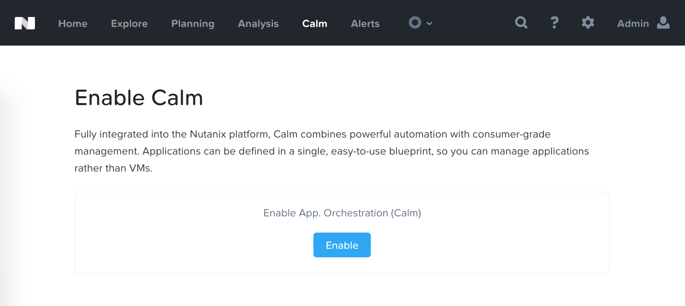
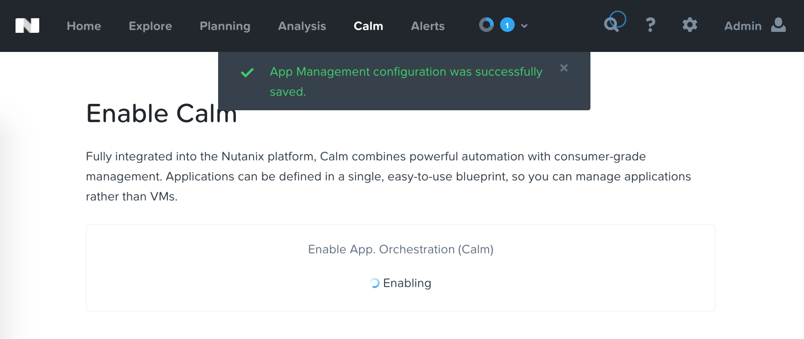
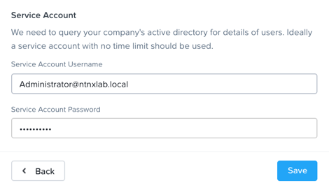

.. _calm_enable:

------------
Calm: Enable
------------

Overview
++++++++

  Estimated time to complete: **5 MINUTES**

Enabling App Management
+++++++++++++++++++++++

Open \https://*<Prism-Central-IP>*:9440/ in a browser and log in.

From the navigation bar, select **Service > Calm** 

Click **Enable**.

Select **Enable App Management** and click **Save**.

.. note:: Nutanix Calm is a separately licensed product that can be used with Acropolis Starter, Pro, or Ultimate editions. Each Prism Central instance can manage up to 25 VMs for free before additional licensing is required.

.. figure:: images/581enable2.png

You should get verification that Calm is enabling, which will take 5 to 10 minutes.

Adding Active Directory
+++++++++++++++++++++++

While we're waiting for Calm to enable, we'll add an Active Directory server.  While this isn't required for basic Calm use, it is required to do any Role Based Access Control, so it's a good idea to get set up.

Click the **Gear Icon** and then click **Authentication**.

In the pop up, click **New Directory**.

.. figure:: images/581enable5.png

Fill out the following fields and click **Save**:

- **Directory Type** - Active Directory
- **Name** - NTNXLAB
- **Domain** - ntnxlab.local
- **Directory URL** - ldaps://*<DC-VM-IP>* 10.42.xx.yz
- **Username** - Administrator@ntnxlab.local
- **Password** - nutanix/4u

.. figure:: images/581enable6.png

Refresh the browser and select **Calm** from the navigation bar.  If Calm is still enabling, wait another minute, and try again.

.. figure:: images/581enable7.png
