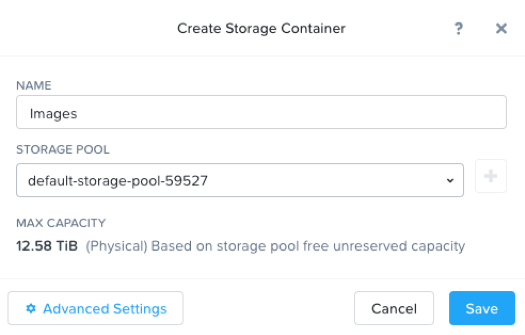
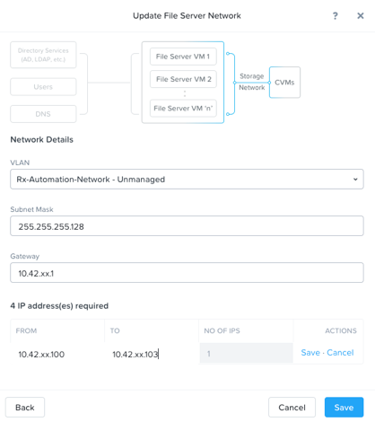
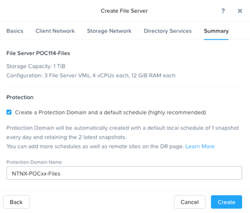

.. _files_deploy:

---------------
 File Services
---------------

Overview
++++++++

.. note::

  Estimated time to complete: **1 HOUR**

In this exercise you will use Prism to deploy Files, a native, distributed file server solution for Nutanix clusters. You will configure SMB share, and familiarize yourself with new features of the AFS offering.

In following steps, you may replace xx with your assigned cluster ID

  
Create AD VM for AD/LDAP connectivity
+++++++++++++++++++++++++++++++++++++++++
In Prism>Storage , create a Storage Container called **Images** if there is no existing one of that name.

Using an SSH client, connect to the Node A CVM IP <10.42.xx.29> in your assigned block using the following credentials:

Username - nutanix

Password - default

Execute the following commands to upload AD image:

.. code-block:: bash

  acli image.create AutoDC container=Images image_type=kDiskImage source_url=https://s3.amazonaws.com/get-ahv-images/AutoDC2.qcow2

Now we are going to create an AD VM from image AutoDC. AD is a pre-requirement of File Service. This AD service is different from the AD service created from a Windows Server. We use it just to simplify the lab and you can take a brief view of file service deployment. 

In **Prism > VM**, click **+ Create VM**

.. image:: images/image003.png

   
click **+ Add New Disk** , choose **Clone from Image Service** and image ‘AutoDC’，click **Add**.

.. image:: images/image005.png

Click **+Add new NIC** and choose **Secondary**, click **Add**.

 
After AD VM is created successfully, power on AD VM, then launch console to see domain name, IP Address and credentials of AD. Record down them. The information will be used later.

.. image:: images/image008.png

Deploy Acropolis File Services
++++++++++++++++++++++++++++++

In **Prism > File Server**, click **+ File Server**.

Firstly, download Files 3.2.0.2 package, click **Continue** to install File Services Software on POCxx.
Secondly, add Data Services IP as 10.42.xx.38. Click Continue.

.. image:: images/image009.png

Fill out the following fields and click **Next**:

- **Name** - *intials*-Files (e.g. POCxx-Files)
- **Domain** - ntnxlab.local
- **File Server Size** - 1 TiB
  
  
.. image:: images/image010.png

Select the **Secondary - Managed** VLAN for the Client Network. Specify your cluster's **AutoDC** VM IP as the **DNS Resolver IP**. Click **Next**.

.. note::

  In order for the Files cluster to successfully find and join the **ntnxlab.local** domain it is critical that the **DNS Resolver IP** is set to the **AD** VM IP **FOR YOUR CLUSTER**. By default, this field is set to the primary **Name Server** IP configured for the Nutanix cluster, **this value is incorrect and will not work**.

Fill out the following fields and click **Next**:

- **Subnet Mask** – 255.255.255.128
- **Gateway** – 10.42.xx.129
- **IP** – **from** 10.42.xx.152 **to** 10.42.xx.154 (click **save** on the right)
- **DNS** – 10.42.xx.157 (AD VM IP address)
- **NTP** – 0.pool.ntp.org,0.au.pool.ntp.org,2.au.pool.ntp.org,0.sg.pool.ntp.org,1.sg.pool.ntp.org

.. image:: images/image011.png

.. note::

 Files requires n (n, being the number of FSVMs) IP addresses on the Client network: 1 IP address per FSVM.

Select the **Rx-Automation-Network** VLAN for the Storage Network. Click **Next**.

Fill out the following fields and click **Next**:

- **Subnet Mask** – 255.255.255.128
- **Gateway** – 10.42.xx.1
- **IP** – **from** 10.42.xx.100 **to** 10.42.xx.103 (click **save** on the right)

.. note::
  
  AFS requires n+1 (n, being the number of FSVMs) IP addresses on the Storage network: 1 IP address per FSVM and 1 IP address for the CVMs to reach the FSVM cluster. This additional IP address is a floating highly available IP address. These IP addresses should not overlap with the IP addresses on the Client network.
  It is typically desirable to deploy Files with dedicated networks for client and storage. By design, however, Files does not allow client connections from the storage network in this configuration.

Fill out the following fields and click **Next**:

- Select **Use SMB Protocol**
- **Username** - Administrator@ntnxlab.local
- **Password** - See record from the console
- Select **Make this user a File Server admin**
- Select **Use NFS Protocol**
- **User Management and Authentication** - Unmanaged

.. image:: images/image015.png

Fill out the following fields and click **Create**:

- Select **Create a Protection Domain and a default schedule (highly recommended)**
- **PROTECTION DOMAIN NAME** - NTNX-POCxx-Files

Monitor deployment progress in **Prism > Tasks**.

.. note::

  If you receive a warning regarding DNS record validation failure, this can be safely ignored. The shared cluster does not use the same DNS servers as your Files cluster, and as a result is unable to resolve the DNS entries created when deploying Files. We will use FSVM IP to access the File service from test Windows VM

Upon completion, select the **AFS** server and click **Protect**. Click **+Add schedule** to make a snapshot schedule you plan.

Observe the default Self Service Restore schedules, this feature controls the snapshot schedule functionality. Supporting Previous Versions allows end users to roll back changes to files without engaging storage or backup administrators. Note these local snapshots do not protect the file server cluster from local failures and that replication of the entire file server cluster can be performed to remote Nutanix clusters. Click **Close**.

Configuring SMB Home Share
+++++++++++++++++++++++++++

In **Prism** > **File Server**, click **+Share/Export**. 

Fill out the following fields and click Next:
- **Name** – home
- **File Server**- POCxx-Files
- **Select Protocol** - SMB
 
 

Select **Enable Access Based Enumeration (ABE)**, **Self Service Restore** and **Advanced Settings**. Select **Home directory and User Profiles** and click **next**

.. image:: images/image020.png

Review Summary tab and click **create**
 
 
.. image:: images/image021.png

Login to your **Windows tool VM** , add domain *ntnxlab.local*, restart this windows VM and login in with AD administrator credentials, test the avaiability of the share you created. If home share \\\\10.42.xx.152\\home is avaiable, create a new folder named **marketing** under home share.

.. image:: images/image024.png

.. image:: images/image023.png

