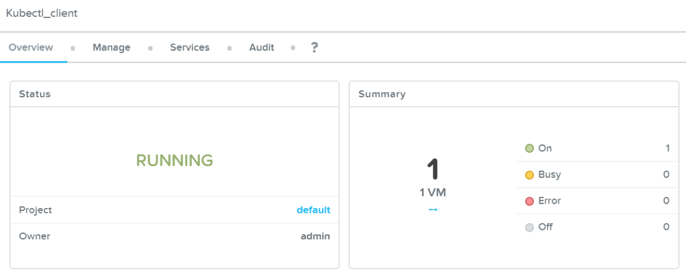

.. _karbon_create_cluster:

-------------------------------------
Creating a Kubernetes Cluster
-------------------------------------

Overview
++++++++

Before we can deploy an application using kubernetes we need to create a Kubernetes cluster.

The cluster that we are going to create consists out of the following VMs:

- 1 Master node (VM)
- 3 Worker node (VMs)
- 3 etcd nodes (VMs)

.. note::

  For more information on the terms master, worker and etcd, please look at https://kubernetes.io/docs/concepts/.

Create a Karbon Kubernetes Cluster
++++++++++++++++++++++++++++++++++

In this exercise you will create a production ready Kubernetes cluster with Nutanix Karbon.

Open https://<Prism-Central-IP>:9440/ in a browser and log in.

Navigate to **Prism Central > Select the Three Dashes > Karbon** and ensure you see a ‘Karbon is successfully enabled’ notification.

Click the link to open the Karbon Console.

.. image:: images/karbon_create_cluster_0.png

Next click **+ Create Kubernetes Cluster**.

Select “Production Cluster” and click **Next**

Fill in the following:

**Name and Environment**

- **Name** - wordpress-*initialsLowerCase*
- **Cluster** - Leave Default selected
- **Kubernetes Version** - 1.10.3
- **Host OS Image** - centos

Click **Next**

Select the virtual network to deploy Kubernetes nodes and click **Next**. The virtual network selected must have AHV IPAM enabled (with DNS & NTP configured in both Prism Central & Prism Elements accordingly). You must also key in an IP Address for the Master VIP that is within the same virtual network but outside of the IPAM range specified for the virtual network.

Enter Service & POD CIDR ranges and click **Next**. Keeping the defaults is recommended for this lab.

Enter a username & password for the selected target Prism Elements cluster with administrative privileges and click **Create**

Wait for the cluster to deploy and reach a healthy status

During the creation of the Kubernetes cluster there will have been created:

- VMs

- Persistent Storage as VolumeGroup

KUBECONFIG
+++++++++++

DOWNLOAD KUBECONFIG
.....................

The objective of the Kubeconfig file is to provide the information for the Kubernetes client to connect to the Kubernetes cluster.
Download the Kubeconfig for the newly deployed cluster 

UPLOAD KUBECONFIG TO THE KUBECTL VM DEPLOYED WITH CALM BLUEPRINT
.................................................................

Navigate to Calm in Prism Central, click applications created through Calm.

Drill in to Kubectl_client.  Navigate to Services

Click on Kubectl Client, find out the IP address of the KUBECTL VM in Calm

Putty and login as nutanix.  The password is default password.

Upload kubeconfig file to VM with putty and run the export command “export KUBECONFIG=/path/to/kubeconfig”.

Create NAMESPACE
+++++++++++++++++

The objective to create namespace in Kubernetes is to segregate the deployment of the application into different namespace.  Eg.  Many WordPress application can be deployed to the same Kubernetes cluster using different namespaces.

Run this command to get the current namespaces

Run this command to create the unique namespace.  Eg trainee-matthew
 

Takeaways
+++++++++

- Nutanix Karbon makes it very easy to create and manage kubernetes clusters
