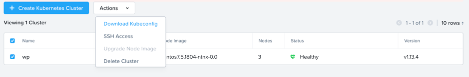
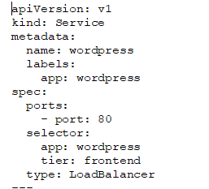
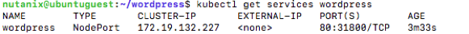
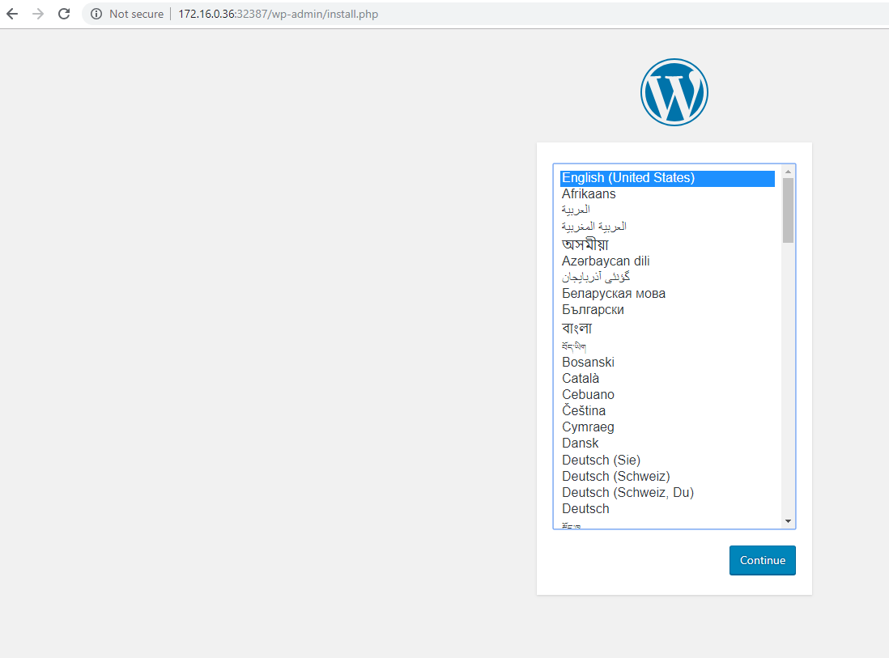

.. _karbon_deploy_application:

-----------------------------
Deploy an Application
-----------------------------

Overview
++++++++

In this module you are going to deploy the Wordpress on the Kubernetes Cluster you've created earlier (using MySQL as the database layer).

Configure kubeconfig using Linux
+++++++++++++++++

The objective of the Kubeconfig file is to provide the information for the Kubernetes client to connect to the Kubernetes cluster. Onto kubenetes cluster you deployed through Karbon , click **Download the Kubeconfig** from **Actions** dropoff.

Click on “Copy the Command to Clipboard”

In Calm, look at the IP address of the provisioned Kubectl client. Opern Terminal and SSH using the IP address with *nutanix* and *default password*

Paste the command into the shell

Run this command to verify the successful connection to the Kubernetes cluster in Karbon.

.. code-block:: bash

	kubectl get nodes

Deploy Wordpress
++++++++++++++++

Now that you have seen the high level information of the kubernetes cluster it is time to deploy our Wordpress application.

Create a directory in the location you are in via the command line named **wordpress**, and change into that directory.

.. code-block:: bash

	mkdir wordpress

	cd wordpress

.. note::

	Kubernetes needs yaml files to create applications and their dependencies.
	You are going to download two yaml files and store them in the just created **wordpress** directory.
	Look at https://www.mirantis.com/blog/introduction-to-yaml-creating-a-kubernetes-deployment/ or at https://kubernetes.io/docs/concepts/workloads/controllers/deployment/ to get more information on yaml and kubernetes.

	** MAKE SURE YOU ARE IN THE WORDPRESS DIRECTORY BEFORE PROCEEDING!!!**

To download the needed yaml file for wordpress mysql deployment run the following command:

.. code-block:: bash

	wget https://kubernetes.io/examples/application/wordpress/mysql-deployment.yaml

To download the needed yaml file for wordpress deployment run the following command:

.. code-block:: bash

	wget https://kubernetes.io/examples/application/wordpress/wordpress-deployment.yaml

.. code-block:: bash

    vi wordpress-deployment.yaml

Use vi to change the line that shows: **type: LoadBalancer** under **spec:** and change ``LoadBalancer`` into ``NodePort``.

.. note::

	Reason for this change is that Karbon does not (yet) support LoadBalanced.

**Change back** to the **kube** directory, and then run the following command to create the mysql password:

.. code-block:: bash

	kubectl create secret generic mysql-pass --from-literal=password=Nutanix/4u!

This should return:

.. code-block:: bash

	secret/mysql=pass created

To check that the password has been created, run the following command:

.. code-block:: bash

	kubectl get secrets

This should show mysql-pass under NAME.

Creating the MySQL database is done by running the following command:

.. code-block:: bash

	kubectl create -f mysql-deployment.yaml

This will also create persistent storage.

.. code-block:: bash

	kubectl get pvc

This storage will also show up in the Karbon UI under **wordpress -> Volume**.

You can now run the following command:

.. code-block:: bash

	kubectl get pods

It will show the wordpress-mysql pod running.

To create the wordpress application, run the following command:

.. code-block:: bash

	kubectl create -f wordpress-deployment.yaml

This will also create persistent storage and a pod.

You can now run the following command:

.. code-block:: bash

	kubectl get pods

It will show both pods running.

Accessing Wordpress
+++++++++++++++++++

Our Wordpress with mysql application is now running.

Now we need to make a connection to the Wordpress UI to configure the application.

To get the IP address where the UI is running, we need to see what the worker nodes are on which the application is running.

Lets show a list of a Master and worker nodes, run the following command:

.. code-block:: bash

	kubectl get nodes

.. image:: images/karbon_deploy_application_23.

Record down one of the worker VM name and it will be used in the next command.

To get the IP address of one of the workers, run the following command:

.. code-block:: bash

	kubectl describe node <worker VM name>|grep "InternalIP"

As the application is running on an internal network inside the kubernetes cluster, we also need to have the service port on which the wordpress application is running.

To see which port number is used to for the Wordpress application, run the following command:

.. code-block:: bash

	kubectl get services wordpress

Putting the IP address and the service port together we can open the Wordpress UI. In our example 10.42.114.119:31800.

In a new Browser tab, go to \http://10.42.114.119:31800

In the initial configuration page, provide the parameters that are asked for.

At the end of the settings, click the **Log in** button and login to the Wordpress UI.

Your Wordpress application with MySQL as the database is running and ready....

Takeaways
+++++++++
