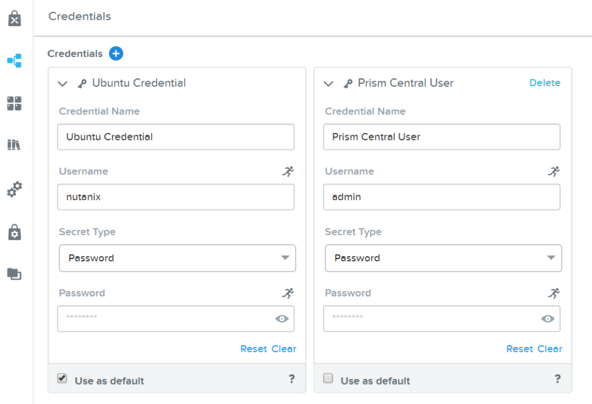

.. _karbon_deploy_vm:

-------------------------
Install KUBECTL from Calm 
-------------------------

Overview
++++++++

.. note::

  Estimated time to complete: **15 MINUTES**

  In this exercise you will create a Kubernetes client from Nutanix Calm Blueprint and verify the result.

  
UPLOAD CALM BLUEPRINT
++++++++++++++++++++++
  
Download the Calm blueprint from *https://matthewnutanixpublic.s3.us-east-2.amazonaws.com/Karbon101/Kubectl_client.json*

Open the Chrome browser.  Click on Save As. Save the file as Kubectl.json to local disk.

Navigate to Calm blueprint, click **Upload Blueprint**

.. image:: images/karbon_deploy_vm_0.png

Select Kubectl_client.json and click on **Upload**.

After the blueprint was uploaded into Prism Central, check the Kubectl_client blueprint

.. image:: images/karbon_deploy_vm_1.png

Scroll down and ensure the OS image: ubu-template.qcow2 was there.  If this image was not available, check back upload image session in previous lab.

.. image:: images/karbon_deploy_vm_2.png

For NIC1, choose **Primary**

Click on Credential.  Ensure the following credential are setup.  In the ubuntu credential, key in the default password as password.

LAUNCH THE BLUEPRINT
+++++++++++++++++++

Click on **Launch**

Fill in the name.  *Kubectl_client*.  Click on Create.

.. image:: images/karbon_deploy_vm_4.png

The Kubectl_client application was provisioning. Monitor the progress until provisioning of Kubectl_client was completed successfully.

VERIFICATION
+++++++++++++

Click on Services. Click on KubectlClient.  

.. image:: images/karbon_deploy_vm_6.png

Click on “Open Terminal”

Select the credential (Ubuntu Credential).  Click on Proceed

Key in “which kubectl”

The command here is to verify kubeclt is installed and to confirm the location so that it can be made executable.
