.. _karbon_enable:

-----------------------
Enable and Upload image
-----------------------

Overview
++++++++

.. note::

  Estimated time to complete: 15 Minutes

In this lab we will enable Karbon and upload ubuntu image for Kebernetes client VM, then we will prepare network for Karbon.

UBUNTU OS Image upload
++++++++++++++++++++++
  
Open a terminal and SSH to POCxx-ABC CVM, enter CVM credentials then execute following commands
  
.. code-block:: bash

 ssh nutanix@10.42.xx.29    # Enter 'Y' when prompted to proceed, password: techX2019!

 acli image.create ubu-template.qcow2 container="Images" image_type="kDiskImage" source_url="https://testisos.s3-ap-southeast-1.amazonaws.com/ubu-template.qcow2

Login in to Prism Central, navigate to Images, click **import Images**，select cluster POCxx-ABC and choose the image you uploaded through SSH, click **Save**. I will see ubu-template image in the list.

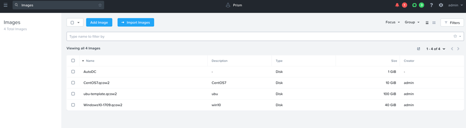

Enable Karbon
+++++++++++++

Navigate to **Administrator** -> **LCM** to see current Karbon version, if it is not 1.0.1, upgrade to the latest 1.0.1 version.

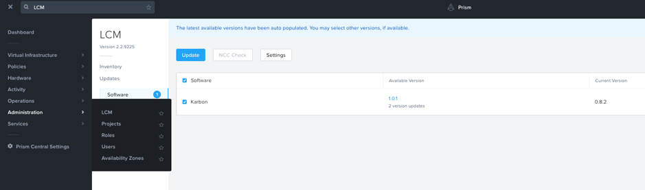

Navigate to **Service** -> **Karbon**

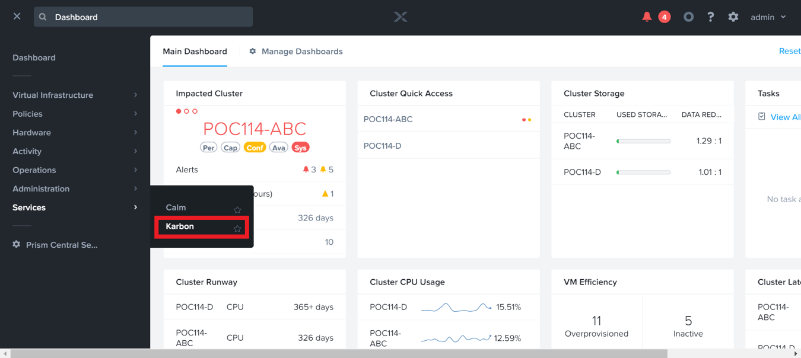

Click **Enable Carbon**

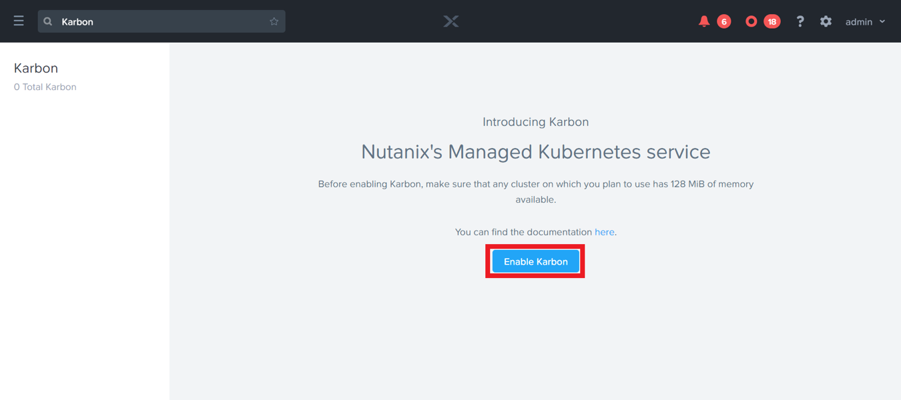

Upon enabling Karbon, launch the console

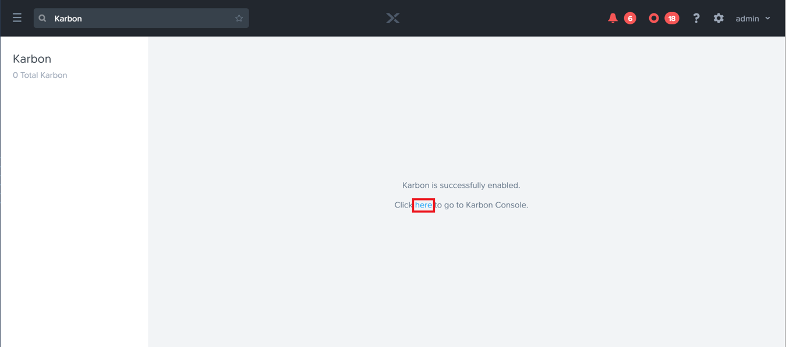

To download host OS image, click **Download CenOS**

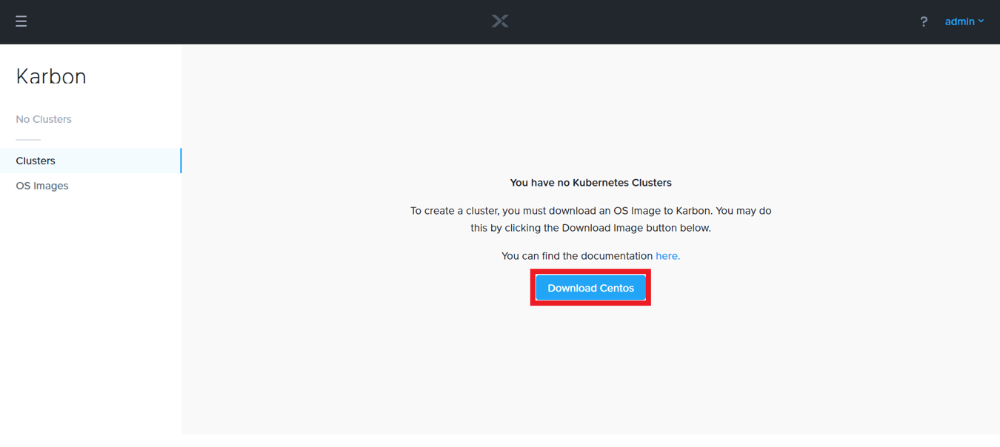

Wait until you see the status changed to downloaded

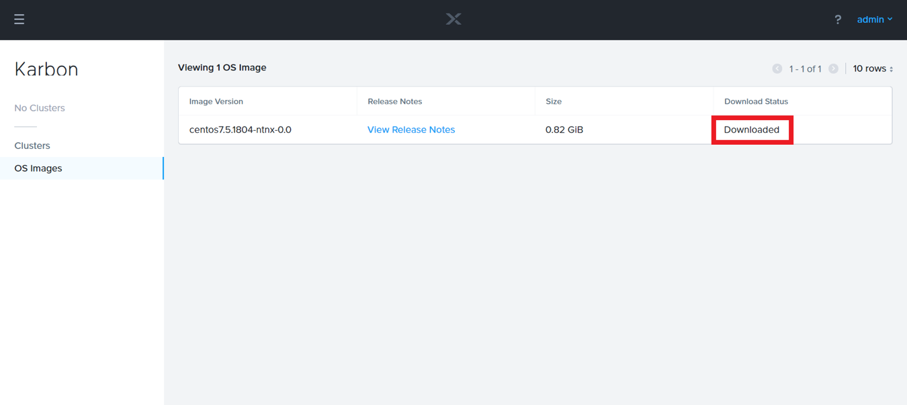

NTP and Network for Karbon
++++++++++++++++++++++++++

Prism Element and Prism Central require NTP to enable Karbon

Navigate to **Prism Central Settings** -> **NTP Servers**

Key in *0.pool.ntp.org* and click **+Add**

.. image:: images/karbon_enable_9.png

Open \https://*<POCxx-ABC Cluster IP>*:9440 (\https://10.42.xx.37:9440) in your browser and log in with the following credentials:

- **Username** - admin
- **Password** - techX2019!

In **Prism > Settings > Network Configuration**, click **+Create Network**.

Fill out **Name** – K8snet and **vlan** – 0 , select **Eable IP address Management** and click **Save**:

Fill out the following fields 

- **Network IP Address** – 10.42.xx.0/25
- **Gateway IP Address** – 10.42.xx.1
- **Domain Name Servers** - 10.42.196.10

Click **+Create Pool**, fill out the range for 10.42.xx.70 to 10.42.xx.90, select **Override DHCP Server**，and click **Save**:

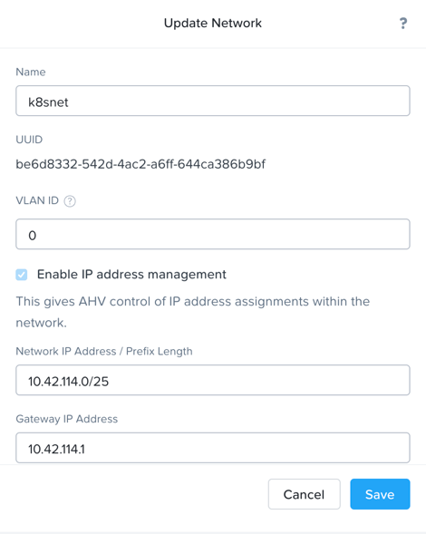

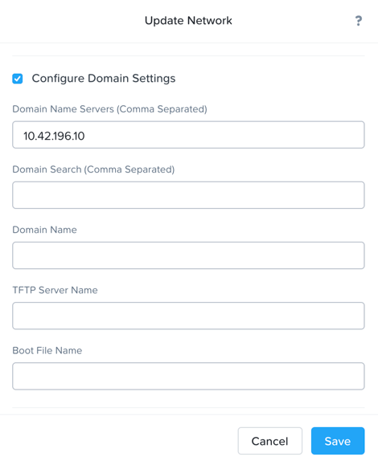

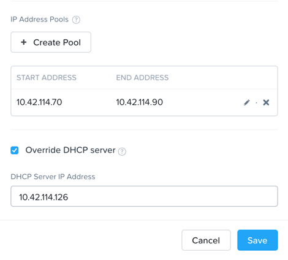

Open \https://*<Prism Central IP>*:9440 (\https://10.42.xx.39:9440) in your browser and log in with your credentials.

Navigate to **Calm > Project** Click **default**, select **k8snet** to add it to Calm network.

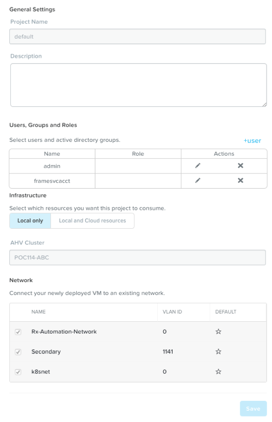

Click **Save**.

