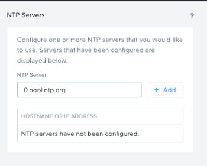

.. _karbon_enable:

-----------------------
Enable and Upload image
-----------------------

Overview
++++++++

In this lab we will deploy..

.. note::

  The following actions **can not** be undone!!! If running this in a production environment be very careful.

UBUNTU OS Image upload
++++++++++++++++++++++
  
Open a terminal and SSH to POCxx-ABC CVM, enter CVM credentials then execute following commands
  
.. code-block:: bash

 ssh nutanix@10.42.xx.29    # Enter 'Y' when prompted to proceed, password: techX2019!

 acli image.create ubu-template.qcow2 container="Images" image_type="kIsoImage" source_url="https://testisos.s3-ap-southeast-1.amazonaws.com/ubu-template.qcow2

Login in to Prism Central, navigate to Images, click **import Images**，select cluster POCxx-ABC and choose the image you uploaded through SSH, click **Save**. I will see ubu-template image in the list.

.. image:: images/karbon_deploy_cvm_1.png

Enable Karbon
+++++++++++++

Navigate to **Administrator** -> **LCM** to see current Karbon version, if it is not 1.0.1, upgrade to the latest 1.0.1 version.

.. image:: images/karbon_deploy_cvm_8.png

Navigate to **Service** -> **Karbon**

Click **Enable Carbon**

.. image:: images/karbon_deploy_cvm_3.png

Upon enabling Karbon, launch the console

.. image:: images/karbon_deploy_cvm_4.png

To download host OS image, click **Download CenOS**

.. image:: images/karbon_deploy_cvm_5.png

Wait until you see the status changed to downloaded

NTP and Network for Karbon
++++++++++++++++++++++++++

Prism Element and Prism Central require NTP to enable Karbon

Navigate to **Prism Central Settings** -> **NTP Servers**

Key in *0.pool.ntp.org* and click **+Add**

