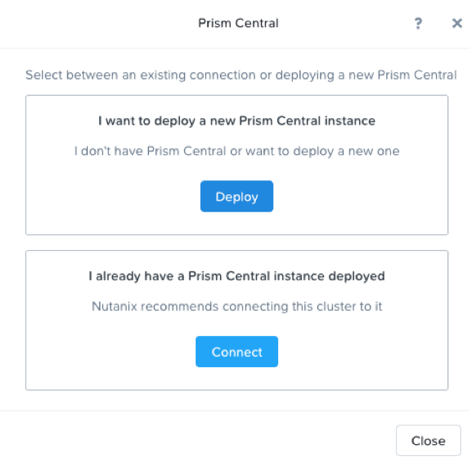
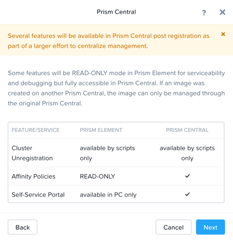
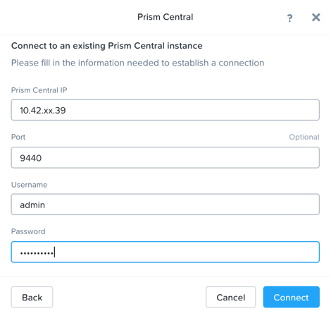

.. _prism_central_dashboards_reports:

-------------------------------------
PC: Deployment
-------------------------------------

Overview
++++++++

.. note::

  Estimated time to complete: **30 Minutes**

This lab will introduce Prism Central’s One-Click deploy process

Prism Central Deploy
+++++++++++++++++++++

Open \https://*<POCxx-ABC Cluster IP>*:9440 (\https://10.42.xx.37:9440) in your browser and log in with the following credentials:

- **Username** - admin
- **Password** - techX2019!

Navigate to **Home** page and click **Register or create new** in Prism Central widget.

.. figure:: images/1.png

Choose the first **Deploy** option.

Download the latest version and click **deploy 1-VM PC**

.. figure:: images/3.png

Fill out the following fields, leave others as default and click **Deploy**:

- **AHV Network** - Primary
- **IP Address** - 10.42.xx.39
- **Subnet Mask** - 255.255.255.128
- **Default Gateway** - 10.42.xx.1
- **DNS Address(Es)** - 10.42.196.10

.. figure:: images/4.png

After Prism Central VM is successfully deployed, open \https://*<PC VM IP>*:9440 (\https://10.42.xx.39:9440) in your browser and log in with the following credentials:

- **Username** - admin
- **Password** - default with capital N
- change password to **techX2019!**

Prism Central Registration
+++++++++++++++++++++

Go back to POCxx-ABC Cluster  (\https://10.42.xx.37:9440), navigate to **Home** page and click **Register or create new** in Prism Central widget. 

.. figure:: images/1.png

Choose the second **Connect** option. 

Click **Next**

Fill out the following fields, leave others as default and click **Connect**:

- **Prism Central IP** - 10.42.xx.39
- **Port** - 9440
- **Username** - admin
- **Password** - techX2019!

You will see an **OK** with PC's IP in Prism Central widget.

.. note::

  Prism Central's default password must be changed before cluster registering PC

